# JOFFERS

Welcome to Our World of Adventure and Entertainment in hotel and resorts all over Croatia!

We are **JOFFERS**, your first step to a gateway to exciting tourism entertainment opportunities in Croatia.
Founded by Ellenor and Mladen, with over 6 years of industry expertise, having served as team managers within the renowned Love Carpe Diem (LCD) tourism entertainment company.

- ### Our Collaboration with Love Carpe Diem

As a collaboration partner of Love Carpe Diem, JOFFERS has a proven track record of success. We are enthusiastic about inviting both new and experienced entertainers, as well as aspiring team managers, to join the "LCD" family through JOFFERS.

- ### Our Mission

At JOFFERS, our mission goes beyond offering jobs; it's an invitation to a global adventure.
We strive to expand our network by building partnerships with reliable and trustworthy companies, creating more avenues for growth and exploration in the dynamic field of tourism entertainment.

- ### Your Rewarding Career Awaits

Embark on a journey where professionalism meets fun, and each day opens doors to endless possibilities. Join JOFFERS and kickstart your captivating career in the world of tourism entertainment, we are here to support you all the way!

Live link can be found here - [JOFFERS](https://evondrus.github.io/joffers/)

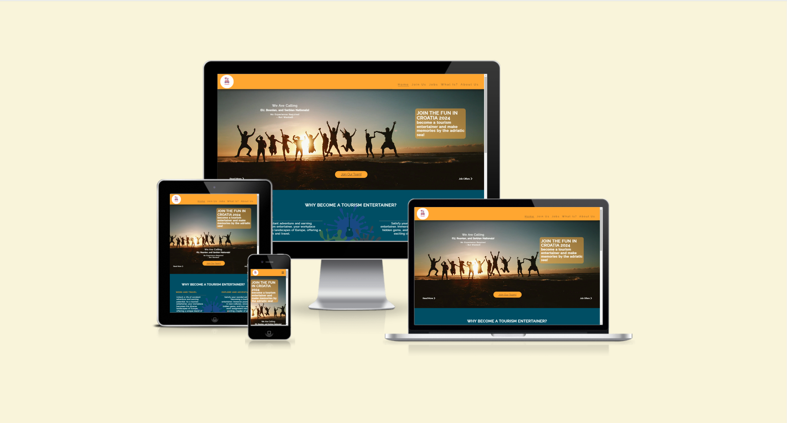

## Overview

- ### Target Audience
Our vibrant opportunities are crafted for individuals aged 18 to 30, holding European, Bosnian, and Serbian passports. We embrace a gender-inclusive approach, welcoming both males and females. If you're an positive and energetic indivitual, passionate about working with kids, engaging in family activities, and/or participating in sports, you're the perfect fit for our diverse team.

- ### Site Owner Goals
    - **Informative Content:** Provide comprehensive information about the benefits of becoming a tourism entertainer through JOFFERS, with a focus on the unique experiences offered from the employing company LOVE CARPE DIEM.

    - **Recruitment Process:** Clearly outline the process for individuals interested in becoming tourism entertainers.

    - **Job Opportunities:** List available positions and any specializations within the entertainment team.

    - **Company Introduction:** Introduce JOFFERS and the founders, highlighting the background, mission, and vision.

    - **Application Process:** Offer a simple, straightforward and user-friendly application process for potential tourism entertainers.

    - **Employee Benefits:** Outline the perks of being a part of JOFFERS and becoming a Tourism Entertainer with the LOVE CARE DIEM company, emphasizing unique benefits like travel opportunities, accomodation and food.

    - **Company Culture:** Communicate the positive and inclusive working environment at LOVE CARPE DIEM, focusing on teamwork, creativity, and the joy of entertaining.

## User experiance

 - ### First-time User
    - As a first-time user, I want to easily navigate and to understand the main purpose of the site and the opportunities it offers for work and travel in Croatia as a tourism entertainer.
    - As a first-time user, I aim to intuitively navigate the website and have a positive initial experience, making it easy to explore available opportunities.
    - As a first-time user, I want to browse through the content related to tourism entertainment without the necessity of signing up or registering.
-I want to easily navigate to the "Join Us" page so that I can sign up and recieve the link for the job application.

 - ### Returning User
    - As a returning user, I want to quickly access the signup form to apply for new opportunities and explore additional job listings.
    - As a returning user, I want to check for updates in the "Job Offers" section to see if there are any new collaborations or work opportunities.
    - As a returning user, I want to connect with Joffers through social media or email to stay informed about the latest developments.

 - ### Frequent User
    - As a frequent user, I want to contribute my experiences or suggestions to Joffers, either through email or by engaging with them on social media.
    - As a frequent user, I want to have a seamless experience across devices, ensuring that the website is accessible and user-friendly.

## Design

- ### Imagery

The imagery in the Joffers Tourism Entertainment website plays a role in enhancing the overall user experience. A consistent theme of travel and entertainment is depicted through selected visuals. Various images showcase lively and engaging scenes, capturing the essence of tourism entertainment experiences. This approach aims to inspire a sense of adventure and excitement in the user. Video showcasing how a day can look like as a Tourism Entertainer. The strategic use of captivating visuals is intended to create an immersive, informative and enjoyable browsing experience.

- ### Colors

The website features a vibrant palette that mirrors the lively spirit of tourism and entertainment. Warm tone oranges dominate, evoking enthusiasm and joy associated with travel and entertainment. Carefully integrated complementary shades ensure a visually appealing and cohesive design, contributing to a positive and engaging atmosphere.

- ### Fonts

The Joffers Tourism Entertainment website predominantly uses the 'Raleway' font for a modern, clean look, ensuring consistency and readability. As a backup Sans serif are designated to maintain clarity in case of font import issues.

- ### Wireframes

I used Balsamiq to ensure thoughtful planning, resulting in a user-friendly and intuitive browsing experience.

Mobile Wireframe

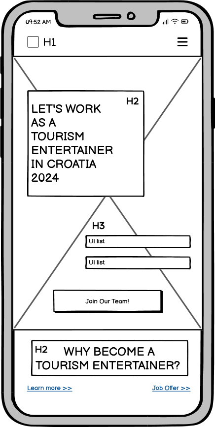

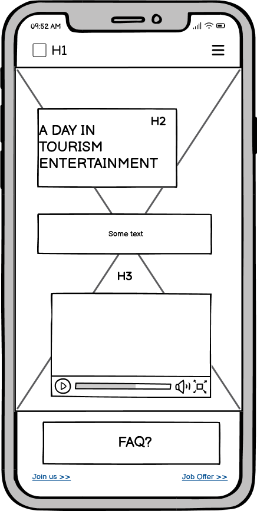
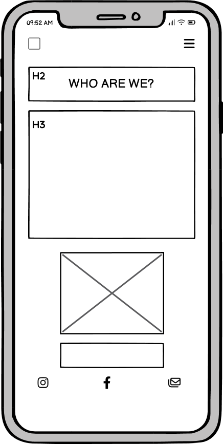
 

 
Desktop Wireframe

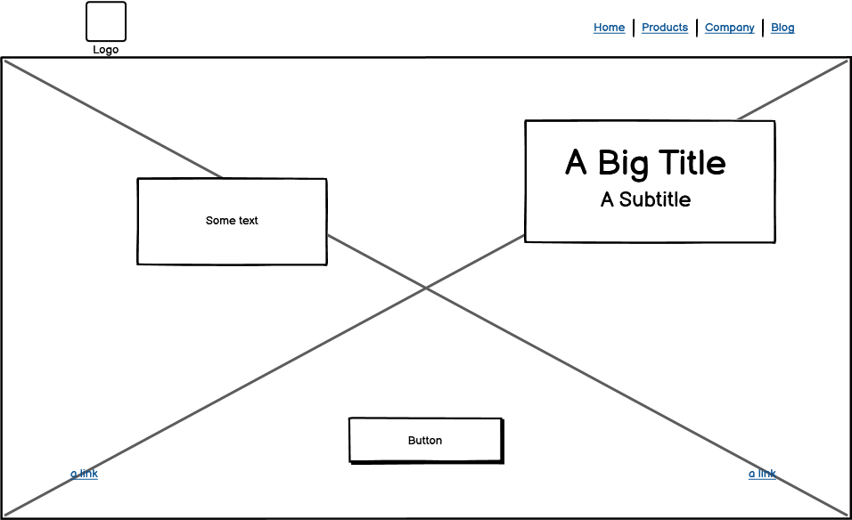

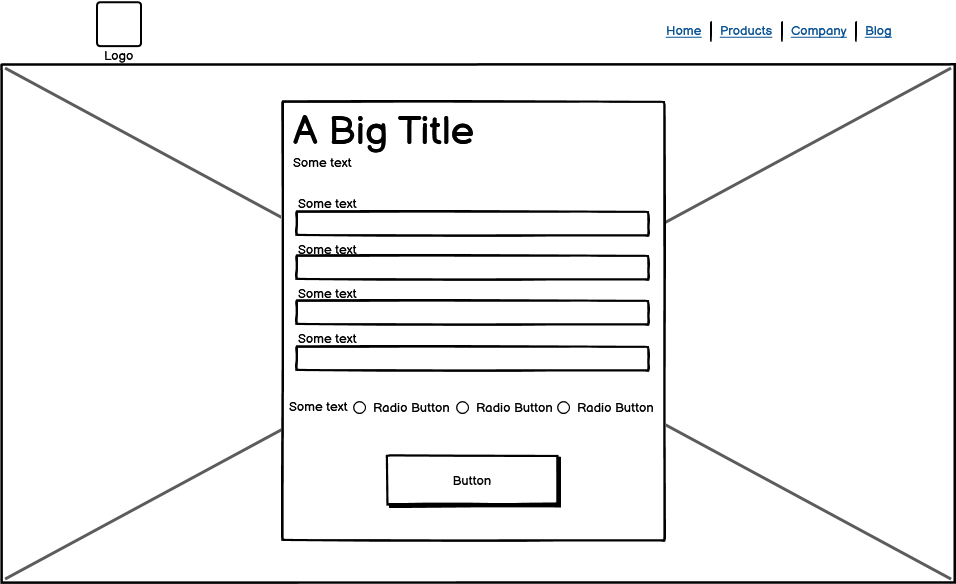
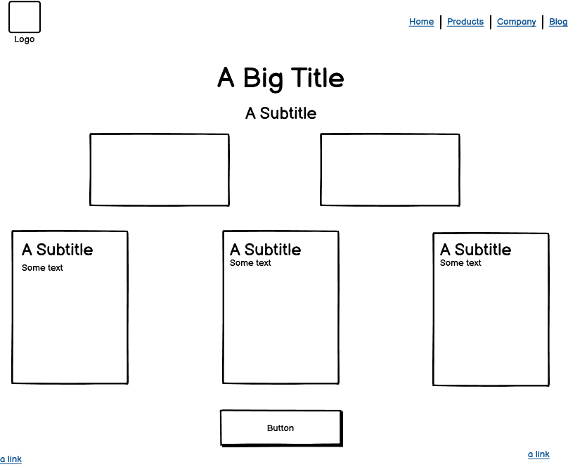
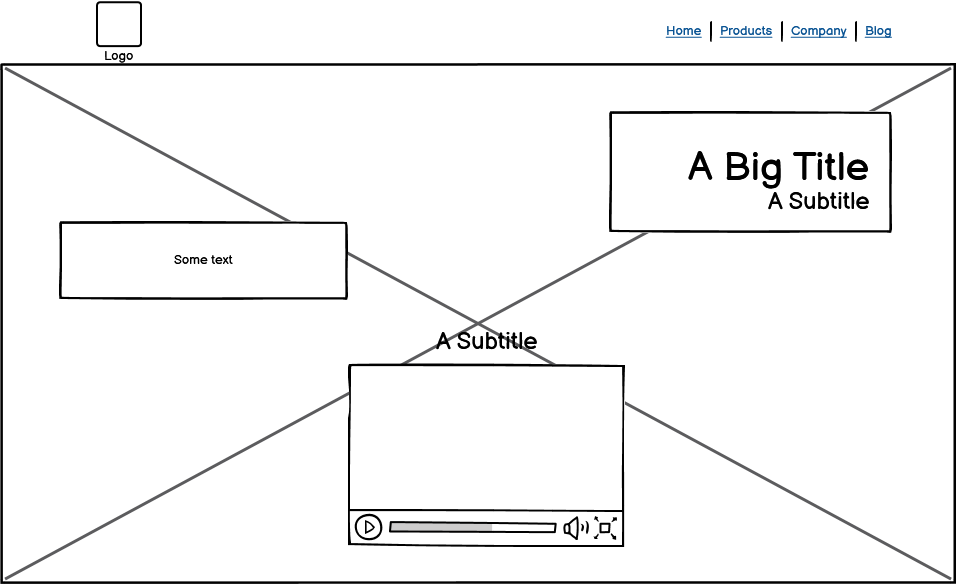
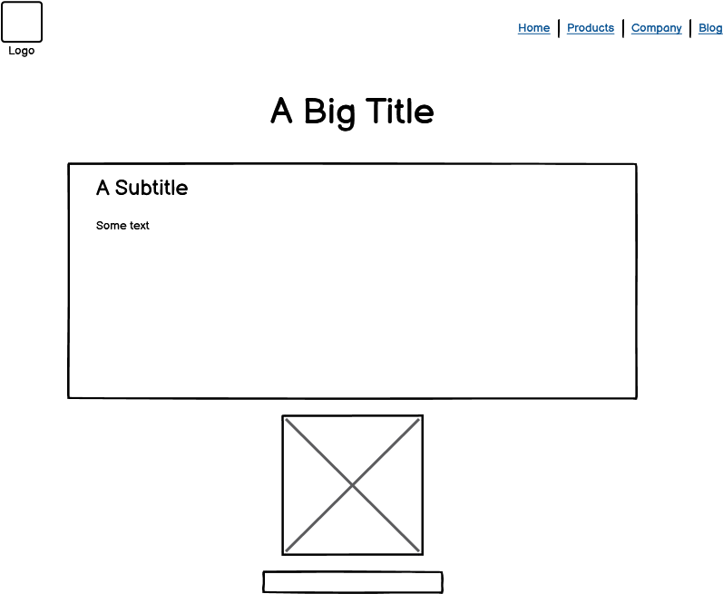

 

    
## Features

- ### Navigation
     - The fully responsive navigation consists of links to the Logo, Home, Join Us, Job Offers, Learn More, and About Us pages.
    - A burger icon with a dropdown menu is incorporated on mobile screens, offering a convenient way to access specific details.
    - The navigation bar has a fixed position, ensuring its visibility at the top during user interactions for seamless exploration.
    - To enhance visibility, a subtle drop shadow distinguishes the navigation bar from other page elements, especially during scrolling.
    - The Burger icon with dropdown menu on mobile screens makes it easy for the user to navigate through the site without any interuption.

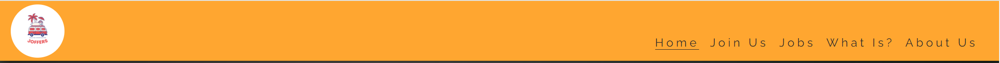

- ### Call-to-Action
    - A prominent button serves as a clear call-to-action, inviting users to sign up and read more.

    - Additional links with chevron icons direct and encourage users to other sections of the website for further exploration.

## The Home Page

- ### Hero Section
    - Joffers' landing page showcases a captivating hero section with a clear image and concise text overlay, effectively conveying the essence of tourism entertainment spirit.

    - Information about who is required to apply.

    - With internal links at the bottom of the section, which is consitant throughout the site, calls-to-action encouraging user to click to sign up or explore the site further. 

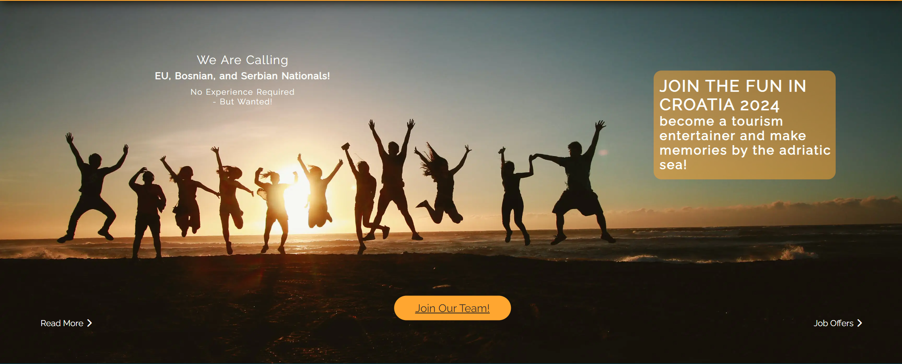

- ### Become Section
    - The Become Section provides compelling reasons to embark on the journey of being a Tourism Entertainer, outlining the adventurous work and travel lifestyle.

    - Captivating descriptions are complemented by an enticing image, with clear calls-to-action, inviting users to explore further.

    - This section aims to showcase the unique and fulfilling aspects of becoming a Tourism Entertainer, encouraging users to delve deeper into the opportunities available.

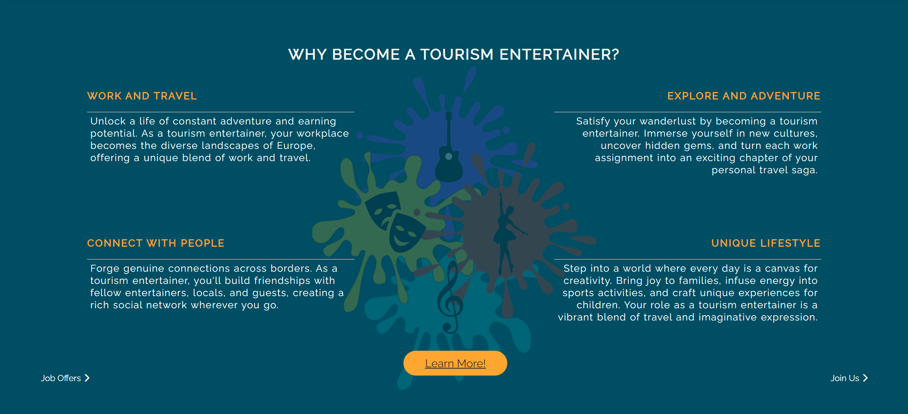

- ### Expectation Section
    - The 'Expectation' section is a curated collection of insights outlining three key aspects of the JOFFERS experience. 

    - Each segment offers personalized support and guidance. 

    - This section serves as a valuable resource for individuals navigating job applications, seeking tailored responses, and exploring work and travel decisions.

    - With clear navigation, it's designed to provide a comprehensive understanding of what Joffers brings to your journey.

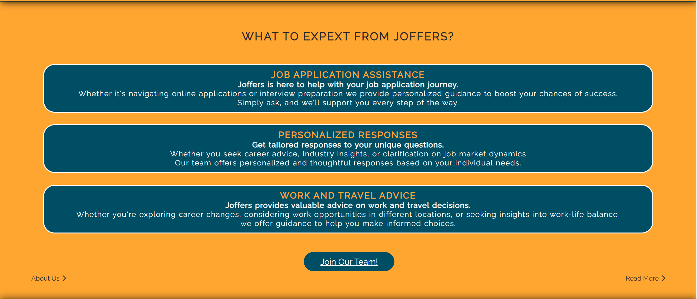

## Join Us Page

- The page features a clean design with an uplifting colorful background image. 

- The Join Us Page simplifies the onboarding process, offering a user-friendly form for potential new team members.

- Upon submission, an email within 24 hours delivers a link to the job application form and additional information, initiating the exciting journey.

- ### Form Elements

    - **First Name**: Input field for the user's first name.
    - **Last Name**: Input field for the user's last name.
    - **Age**: Numeric input for the user's age (between 18 and 40).
    - **Email Address**: Input field for the user's email address.
    - **Work Preference**: Radio buttons for selecting work preferences, including options for sports, kids, or both.
    - **Submit button**: Button for submitting the form.

## Job Offers Page

- ### Job Offers Section
    - The Job Offers page highlights key benefits for potential recruits, presented in two columns for clarity.
    - Bullet points outline the enticing package, including salary, bonuses, accommodation, meals, transportation, contract details, work hours, and insurance.
    - A compelling message emphasizes the adventurous aspect of the offered positions.

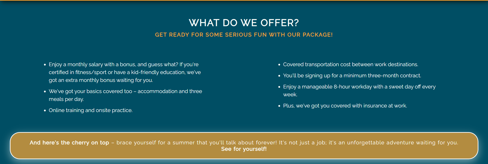
  
- ### Open Positions Section
    - The "Open Positions" header introduces job opportunities with engaging icons.
    - Individual job listings for Sport & Fitness Entertainer, Kids Entertainer, and All-round Entertainer provide detailed descriptions.
    - The prominent "Join Our Team!" button serves as a clear call-to-action, inviting users to explore job opportunities.
    - Additional links direct users to other sections of the website for further exploration.
  
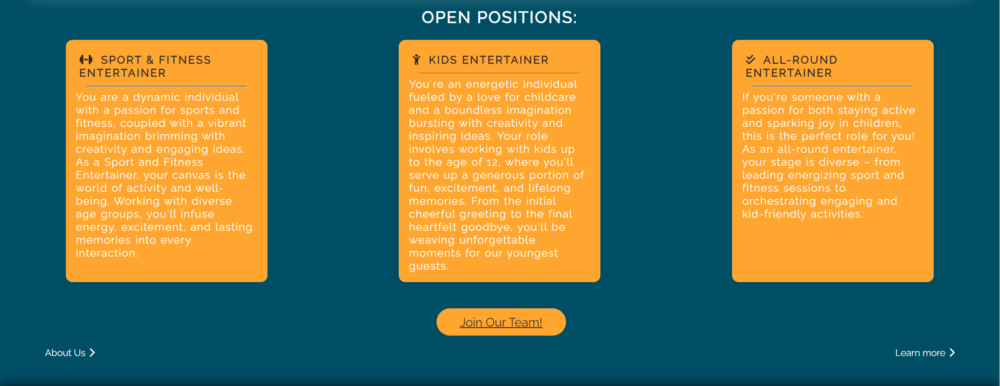

## Learn More page

- This page paints a vivid picture of the unique lifestyle experienced by those working in tourism entertainment.
- Users are encouraged to take the first step toward this exciting journey. The "You're only 3 steps away" paragraph guides them to sign up on the Joffers website.

-  The video provides an immersive visual representation of the exciting world of tourism entertainment, offering more than words could convey.

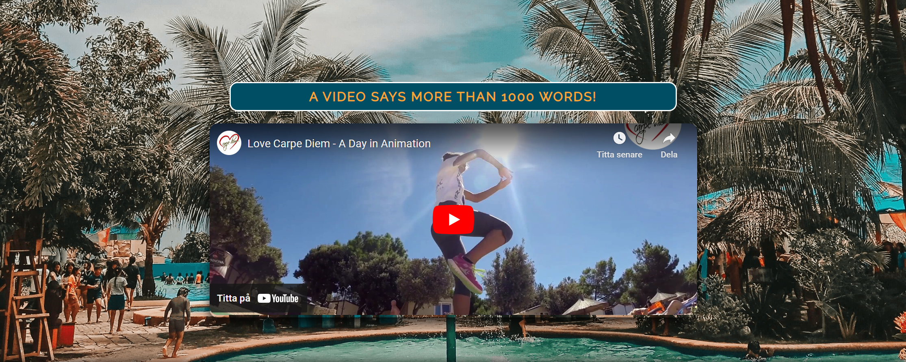

## About Us page

- The page encourages users to join JOFFERS and commence their journey in the captivating realm of tourism entertainment.
- Explaining who the founders of JOFFERS are and about their experiance and expertice to make users feel secure.
- The page explaining the mission of JOFFERS, which is to expand the network by forging partnerships with reliable and trustworthy companies, creating avenues for growth and exploration.

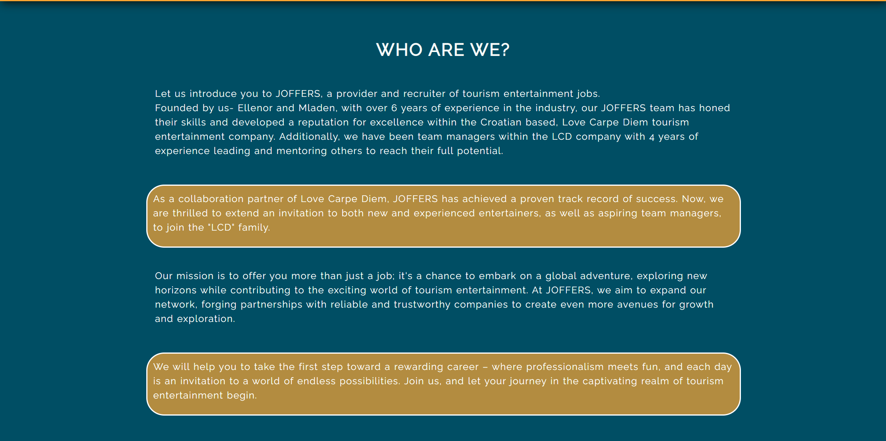

- The section concludes with and image and the names of the founders: Ellenor Vondrus & Mladen Djurdjevic.

 ### Footer

- The footer section of Joffers Tourism Entertainment is designed for easy connectivity, featuring links to our Instagram, Facebook, and email. 
- These links open in new tabs, providing seamless navigation for users to stay updated on our social media channels or reach out via email. 
-The footer serves as a convenient hub for users to connect with Joffers through various online platforms, ensuring accessibility and engagement.

### Features Left to Implement

- Create a FAQ page for the most common questions and answers about Tourism Entertainment.
- Create a 404page to display in case of any broken links.
- Create a Thank you page to display when submitting the Sign up form.
- The ability to search for jobs as the bank of job opportunities eventually grows.

## Technologies Used

### Programming Languages
- HTML5
- CSS

## Testing 

### Validator Testing
- #### HTML
    - No errors were returned when passing through the official W3C Markup Validator
        - [W3C Validator Results](https://validator.w3.org/nu/?doc=https%3A%2F%2Fevondrus.github.io%2Fjoffers%2F)
- #### CSS
    - No errors were found when passing through the official W3C CSS Validator 
        - [W3C CSS Validator Results](https://jigsaw.w3.org/css-validator/validator?uri=https%3A%2F%2Fevondrus.github.io%2Fjoffers%2F&profile=css3svg&usermedium=all&warning=1&vextwarning=&lang=sv)
- #### Accessibility 
    - The website obtained a perfect Lighthouse accessibility score of 100%, verifying that the selected colors and fonts ensure easy readability and accessibility.
    

 ### Form Testing
- The form has been tested to ensure it would not submit without the required input fields being filled in (full name and email address).

### Links Testing
- All navigation links were tested manually to ensure the user is directed to the correct section of the website.
- Social Media links in the footer of each page were tested manually to ensure they direct the user to the correct page and open in a new tab. 

### Browser Testing
- The website was tested in Google Chrome, Microsoft Edge and Firefox browser with no issues noted.

### Device Testing
- The website was viewed on a variety of devices such as Desktop, Laptop, iPhone 7, iPhone11 Pro Max, and iPad to ensure responsiveness on various screen sizes. The website performed as intended.
- I also used the following websites to test responsiveness:
    - [Responsinator](http://www.responsinator.com/?url=https%3A%2F%2Fevondrus.github.io%2Fjoffers%2F)
    - [Am I Responsive](https://ui.dev/amiresponsive?url=https://evondrus.github.io/joffers/)

### Friends and Family User Testing
Friends were asked to review the site and documentation to point out any bugs and/or user experience issues.

### Unfixed Bugs
- The button class contains an absolute position, which creates a problem when the class is used on other section or pages.
- *Iam temporary solving the problem by creating an separate id for buttons used outside the index page.*

### Libraries - Programs - Frameworks
- [Am I Responsive](http://ami.responsivedesign.is/) - Verify website responsiveness on various devices.
- [Responsinator](http://www.responsinator.com/) - Check responsiveness on different devices.
- [Balsamiq](https://balsamiq.com/) - Generate wireframe images.
- [Chrome Dev Tools](https://developer.chrome.com/docs/devtools/) - Development, testing, and performance optimization.
- [Font Awesome](https://fontawesome.com/) - Social media icons in the footer.
- [GitHub](https://github.com/) - Version control and hosting.
- [Google Fonts](https://fonts.google.com/) - Import and alter fonts on the page.
- [TinyPNG](https://tinypng.com/) - Compress images without a reduction in quality.
- [W3C](https://www.w3.org/) - HTML & CSS Validation.

## Deployment

The project was deployed using GitHub Pages. Follow these steps for deployment:

1. Go to the repository on GitHub.com
2. Select 'Settings' near the top of the page.
3. Choose 'Pages' from the menu bar on the left.
4. Under 'Source', select the 'Branch' dropdown and choose the main branch.
5. Click 'Save'.
6. Deployment is confirmed by a message on a green background saying "Your site is published at" followed by the web address.

Live link can be found here - [JOFFERS](https://evondrus.github.io/joffers/)

### Content
The following websites provided the educational text content:
- [JOFFERS](https://joffersearch.rs/)
- [Love Carpe Diem](https://www.carpe-diem.hr/)

### Media
All photographs and videos were obtained from the following websites, and I express my gratitude to the talented photographers and videographers involved.
- [Pexels](https://www.pexels.com/)
    - Belle Co - Hero section image, Group jumping during golden hour.
    - Alexander Grey - Join Us page image, Kid with multicolor handprint.
    - Marfil Graganza Aquino - Learn More page image, Hotel swimming pool.
- [Pinclipart](https://www.pinclipart.com/)
    - Ive's Variety Show Team - Become section image, Variety Show.
- [Youtube](https://www.youtube.com/)
    - Love Carpe Diem TV - Learn More page video, A day in Animation.

### Resources Used
- [W3Schools](https://www.w3schools.com/)
- [Stack Overflow](https://stackoverflow.com/)
- [Code Institute](https://codeinstitute.net/) Inspiration for dropdown nav-bar with Burger icon.

## Acknowledgments
I would like to express my gratitude to the Code Institute slack community and the tutors, for the prompt responses and valuable advice throughout this project.

A special thanks to my mentor, Antonio Rodriguez, for his unwavering support, invaluable feedback, which greatly contributed to the development and improvement of this project.